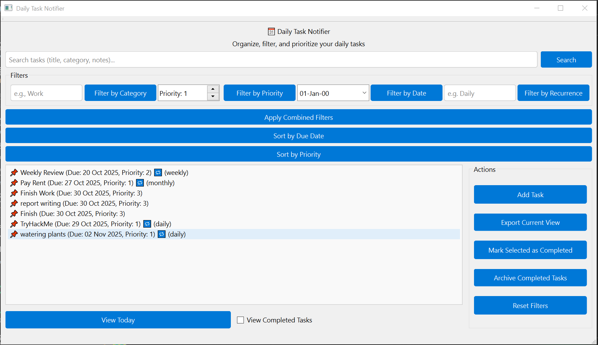

# 🗓️ Daily Task Notifier (C++ Desktop App)

A lightweight desktop application that displays your routine tasks for the day upon computer startup. Built in C++ to demonstrate practical applications of core data structures, algorithms, and GUI design using Qt.

---

## 📌 Project Overview

- **Language**: C++
- **Purpose**: Help users remember daily routine tasks by showing them at system startup
- **Scope**: Console-based logic with GUI frontend, file I/O, task filtering, recurrence logic, and priority sorting
- **Status**: Phase 5 (GUI Integration) completed ✅

---

## 📁 Project Structure

```
/DailyTaskNotifier
│
├── include/                     # Header files (interfaces)
│   ├── Task.h                   # Task class declaration
│   └── TaskManager.h            # TaskManager class declaration
│
├── src/                         # Source files (implementations)
│   ├── main.cpp                 # Entry point of the application
│   ├── Task.cpp                 # Task class implementation
│   ├── TaskManager.cpp          # TaskManager implementation
│   ├── mainwindow.cpp           # GUI logic and signal-slot connections
│   └── mainwindow.ui            # Qt Designer layout (XML)
│
├── data/                        # Persistent storage
│   └── tasks.txt                # Task data file (text format)
│
├── README.md                    # Project documentation
```

---

## 🧱 Data Structures Used

| Structure                             | Purpose                                                 |
| ------------------------------------- | ------------------------------------------------------- |
| `class Task`                          | Encapsulates task details (title, date, priority, etc.) |
| `std::vector<Task>`                   | Stores all tasks dynamically                            |
| `std::map` *(planned)*                | Group tasks by date or category                         |
| `std::priority_queue` *(planned)*     | Sort tasks by urgency                                   |
| `std::ifstream` / `std::ofstream`     | File I/O for persistent storage                         |

---

## ⚙️ Algorithms Implemented

| Algorithm          | Purpose                                                   |
| ------------------ | --------------------------------------------------------- |
| Date parsing       | Converts string to `std::tm` for comparison               |
| Task serialization | Converts task to string format for saving                 |
| File parsing       | Reads tasks from `tasks.txt` and loads into memory        |
| Recurrence logic   | Supports `none`, `weekly`, and `monthly` recurrence       |
| Priority sorting   | Sorts tasks in ascending order of urgency                 |
| Title search       | Finds tasks by keyword match (case-insensitive)           |

---

## ✅ Phase Breakdown

### 🧩 Phase 1–4: Core Logic & CLI
- Finalized project scope and DSA plan
- Designed `Task` class with serialization
- Implemented `TaskManager` with:
  - Task loading/saving from file
  - Task creation and listing
  - Filtering by today's date
  - Recurrence support (`weekly`, `monthly`)
  - Priority-based sorting
  - Case-insensitive keyword search
- CLI menu with interactive options
- Startup banner and motivational message

### 🖼️ Phase 5: GUI Integration (Qt)
- Selected Qt for cross-platform GUI
- Designed layout in Qt Designer (`mainwindow.ui`)
- Split interface into:
  - Top: Title, search bar, filters
  - Bottom: Task list and action buttons
- Added:
  - Search bar with placeholder
  - Filter group with category, priority, date, recurrence
  - Task list with icons and formatted display
  - Action buttons: Add, Export, Mark Completed, Archive, Reset
  - Checkbox: “Show Completed Tasks”
  - Button: “View Today”
- Connected all widgets to backend logic
- Ensured error-free builds and visual polish

---

## 🖼️ GUI Preview

Here’s a snapshot of the Daily Task Notifier in action:



---

## 📦 Sample Task Format (`tasks.txt`)

```
Title|Category|YYYY-MM-DD|Priority|RecurrenceType
Water Plants|Personal|2025-10-27|2|weekly
Finish DSA Assignment|Academic|2025-10-27|1|none
Call Mom|Personal|2025-10-28|3|none
Weekly Review|Academic|2025-10-20|2|weekly
Pay Rent|Finance|2025-10-01|1|monthly
```

---

## 🛠️ How to Build & Run

### 🧳 Prerequisites
- C++17-compatible compiler (e.g., `g++`, `clang++`, or MSVC)
- [Qt 5 or 6](https://www.qt.io/download) (with Qt Creator recommended)
- CMake (if using CMake build system)
- Git (for cloning the repository)

---

### 🖥️ Option 1: Run via Qt Creator (Recommended)
1. Open `DailyTaskNotifier.pro` or `CMakeLists.txt` in Qt Creator.
2. Configure the project with your preferred kit (e.g., Desktop Qt 6.5.0 GCC 64bit).
3. Click **Build** ▶️ and then **Run**.

---

### 🧱 Option 2: Build from Terminal (CMake)
```bash
# Clone the repository
git clone https://github.com/RazaJavaid2004/DailyTaskNotifier.git
cd DailyTaskNotifier

# Create build directory
mkdir build && cd build

# Configure and build
cmake ..
cmake --build .

# Run the application
./DailyTaskNotifier
```

> 💡 On Windows, the executable will be `DailyTaskNotifier.exe`.

---

### 📂 Data File
The app reads and writes tasks to:
```
data/tasks.txt
```
Make sure this file exists before running, or the app will create it on first save.

---

## 🔁 Run at Startup (Optional)

### 🪟 Windows
1. Press `Win + R`, type `shell:startup`, and hit Enter.
2. Copy the compiled `.exe` file into the opened folder.
3. The app will now launch automatically on system startup.

### 🐧 Linux
1. Create a `.desktop` file in `~/.config/autostart/`:
```ini
[Desktop Entry]
Type=Application
Exec=/path/to/DailyTaskNotifier
Hidden=false
NoDisplay=false
X-GNOME-Autostart-enabled=true
Name=Daily Task Notifier
```
2. Make sure the file is executable:
```bash
chmod +x ~/.config/autostart/DailyTaskNotifier.desktop
```

---

## 👨‍💻 Author

**Muhammad Raza**   
GitHub: [github.com/RazaJavaid2004](https://github.com/RazaJavaid2004)  
LinkedIn: [linkedin.com/in/muhammadraza2006](https://linkedin.com/in/muhammadraza2006)

---
